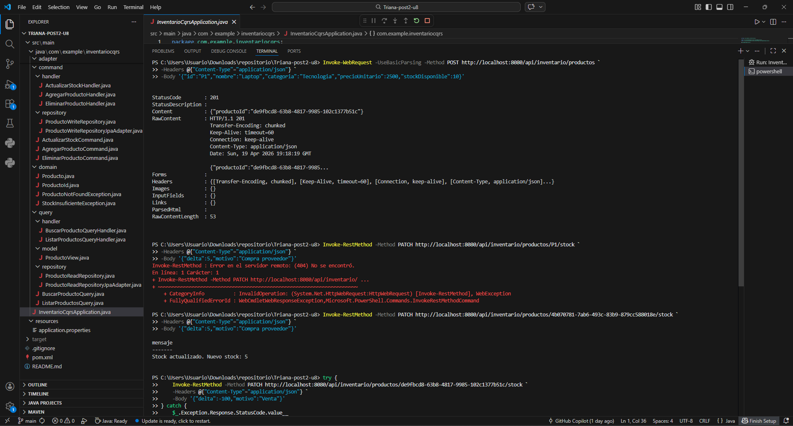
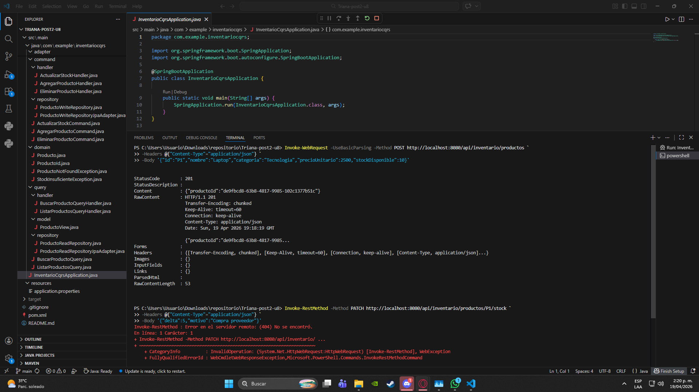

# U8 Post-Contenido 2 - Inventario con CQRS

## Objetivo
Separar rutas y flujo de escritura (Command side) de lectura (Query side) para un modulo de inventario.

## Estructura
- `command`: comandos, handlers y repositorio de escritura.
- `query`: consultas, handlers, modelo de lectura y repositorio de lectura.
- `adapter/web`: endpoints HTTP separados para comando/consulta.
- `domain`: entidad y reglas de negocio.

## Ejecutar
```bash
mvn clean spring-boot:run
```

## Endpoints
- `POST /api/inventario/productos`
- `PATCH /api/inventario/productos/{id}/stock`
- `DELETE /api/inventario/productos/{id}`
- `GET /api/inventario/productos`
- `GET /api/inventario/productos/{id}`

## Evidencias de Verificacion 





| Checkpoint | Estado | Evidencia |
|---|---|---|
| Compila sin errores (mvn compile) | PASS | mvn -q -DskipTests compile |
| POST crea producto y retorna 201 | PASS | status=201, productoId=cd31d54b-cab8-4e2c-9ec6-2b977b918000 |
| PATCH con delta positivo incrementa stock | PASS | status=200 |
| PATCH excediendo stock retorna 400 | PASS | status=400 |
| GET listado incluye estadoStock | PASS | status=200 |


